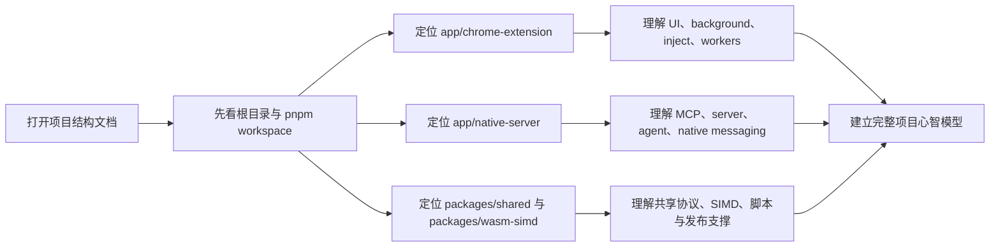

# 项目整体结构说明 ^9d7da2be-74e9-0a97

## [x] immersive-input-chrome 项目整体结构说明 v1.0 [2/2] ^41824305-96c8-0e1d

- 一、需求概述 ^1536194b-e1dd-ee4f
  - [开发者/维护者] 在理解 `immersive-input-chrome` 单仓多包项目时，容易被 Chrome 扩展、Native Server、Shared 包、WASM 包与大量文档/脚本分散注意力，本次在 `docs` 模块实现一份基于模板的项目整体结构展示文档。 ^306a3e01-b655-00f8
  - 需要一眼看懂根目录、workspace、工程配置和脚本分别负责什么。 ^2d4acd05-b28e-b766
  - 需要快速定位 `app/chrome-extension`、`app/native-server`、`packages/shared`、`packages/wasm-simd` 的源码入口与职责边界。 ^1ea52871-91f4-afc2
  - 需要明确 `docs/`、`prompt/`、`releases/`、`.github/`、`.husky/` 等辅助目录的位置；为保证可读性，生成产物目录只做归类说明，不逐项展开。 ^54e82ad5-b541-f10a
- [x] 二、功能信息架构 [1/1] ^3e24078d-2968-7317
  - [x] 产品功能 [1/1] ^c6889e9f-dc6d-6d71
    - [x] 项目整体结构展示文档 [4/4] ^f08eea71-8c79-9afc
      - [x] 已有功能入口 [3/3] ^9fdb5f71-4b27-81f1
        - [x] `README_zh.md`：对外介绍项目定位、安装方式与工具能力。 ^2f4260fa-6c83-60f2
        - [x] `package.json` + `pnpm-workspace.yaml`：monorepo 工作区入口，统一定义 `build`、`dev`、`check`、`typecheck` 等根命令。 ^f6c20cf3-f9c5-00f2
        - [x] `docs/技术方案模板.md`：本次结构说明的模板来源。 ^be4c81a8-7cdc-b8d9
      - [x] [F1] ✨ 项目整体结构总览 `[MVP]` [4/4] ^15d3f525-75de-6aa7
        - [x] 顶层工程与工作区：根配置、`app/*`、`packages/*`、`scripts/*`、`docs/*`、`releases/*` 的角色划分。 ^dde96afd-b0cb-0515
        - [x] Chrome 扩展端源码分层：`entrypoints/`、`background/`、`inject-scripts/`、`shared/`、`utils/`、`workers/` 的协作边界。 ^b7989a05-2901-422a
        - [x] Native Server / MCP / 本地桥接：`src/mcp/`、`src/server/`、`src/agent/`、`native-messaging-host.ts` 的职责拆分。 ^614be63c-60fe-bae3
        - [x] Shared / WASM / 工程支撑：`packages/shared`、`packages/wasm-simd`、`.github/`、`.husky/`、`scripts/`、`prompt/`、`releases/` 的配套关系。 ^9ab9cf23-89d9-57d0
  - 操作流程 ^4d9fd7a1-8c8c-5425

- 三、数据流 ^28db3f4f-0a08-6f83
  - 数据流（用户视角，关键步骤） ^93255501-0abd-dfef
    - [F1] 步骤 1：读者从 `docs/项目整体结构说明.md` 进入项目结构文档 ^daa3d49a-1de9-ecb2
      - 输入：读者希望定位源码目录、运行链路、构建脚本或交付产物。 ^7e9de082-3fa5-075a
      - 用户可见反馈：文档先给出总体分层，再给出目录树与职责说明。 ^511b9fca-51ea-a108
      - 关键产物：`docToken=project-structure-v1` / `mappingKey=repo-root` ^49566941-7c13-3488
    - [F1] 步骤 2：读者按“根目录 → app → packages → scripts/docs/releases”的顺序下钻 ^dd4dde6f-9a26-b114
      - 用户可见反馈：每一层目录都能看到职责边界、代表文件与模块关系。 ^67577936-9cbe-7741
      - 关键状态： ^05ccd6c6-e07b-9e46
        - `workspace-root`：正在建立 monorepo 总览。 ^ec84ff69-15b1-0238
        - `runtime-apps`：正在理解 Chrome 扩展端与 Native Server 的分工。 ^e20d476b-e5b4-787c
        - `supporting-layer`：正在理解 shared、wasm、脚本、文档与发布支撑。 ^229702b9-ab75-fa16
    - [F1] 步骤 3：完成与落地 ^44cfa9a7-ba74-f305
      - 输出：读者获得可复用的目录导航、模块职责说明与主链路定位方式。 ^6a1f3cca-b6d9-ad54
      - 落地位置：正文落地于 `docs/项目整体结构说明.md`；源码定位落地于对应目录路径与关键文件。 ^aeaeba31-011e-ba8a
    - [F1] 步骤 4：失败与恢复 ^ce8de6c4-82e9-3f4d
      - 错误提示：若某目录属于依赖、构建或测试产物，文档明确标注“仅归类，不展开”。 ^93d005a7-c589-f9ba
      - 恢复手段：回到上级目录重新查找；优先从 `README_zh.md`、`package.json`、`pnpm-workspace.yaml` 三个入口回溯。 ^1124db28-65e8-9691
  - 观测与排障（必填，尽量简洁） ^dc12e24d-345d-1559
    - 日志（若后续将本文档接入知识库/站点检索，建议保留以下字段） ^2893ffa0-5919-5e9f
      - 统一字段：`feature`(F1) / `requestId` / `durationMs` / `result`(ok|fail) / `errorCode` ^b0f65c43-ac64-1e51
      - 关键对象字段：`path` / `moduleName` / `sectionId` ^9c61ca6a-c10c-e0ec
    - 指标（可选，但建议至少 1 条） ^f197aadf-48bf-9948
      - 文档命中率：用于回答“新成员能否在一次阅读中定位到目标源码目录”。 ^a2ce4167-7efb-c6c9
    - 关键可回放信息（可选） ^cd8e994a-906a-a98e
      - 保留文档版本号、仓库根路径、目录快照时间，便于后续更新时做结构 diff。 ^e365b933-40f9-8a9f
- 四、系统架构 ^9ed05582-8c5c-26b2
  - 架构摘要 ^a416516d-6fac-365f
  - 架构树 ^2bd3b126-43ec-cad8
    - `/` ^3eac39e3-93c2-f31b
      - `.github/` ^e781dae7-b28e-db18
        - `workflows/build-release.yml` · 扩展打包与发布流程模板，当前文件保留了自动构建/归档思路。 ^97c772cc-175d-a864
      - `.husky/` ^28552127-4e3b-5faf
        - `commit-msg` · 提交信息校验入口。 ^5f89e202-bf63-c313
        - `pre-commit` · 提交前质量校验入口。 ^214716e8-067e-0132
        - `_/` · Husky 生成的底层 hook 包装脚本。 ^ab24383b-d957-0cd7
      - `.vscode/` ^d85afc92-93c5-6450
        - `extensions.json` · 推荐编辑器扩展配置。 ^6aae0fec-5f03-9769
      - `app/` ^f05e5bfe-9c8f-c283
        - `chrome-extension/` · Chrome 扩展应用，基于 `WXT + Vue 3 + Tailwind`。 ^c8b316f0-5a6b-feeb
          - `_locales/` · 多语言资源。 ^a55f9fda-9bea-84f4
          - `common/` · 跨 entrypoint 共享的常量、消息协议、引导类型、节点类型。 ^b6119793-14d3-23f3
          - `entrypoints/` ^36eb64fa-14cc-c06e
            - `background/` · 扩展后台运行时总入口。 ^1264c457-68e4-1db6
              - `tools/browser/` · 浏览器控制、截图、交互、网络、历史、书签、向量检索等工具能力。 ^6292ab89-a908-146b
              - `record-replay/` · 旧版流程录制、节点执行、调度与存储。 ^f69df8f8-9512-2588
              - `record-replay-v3/` · V3 版领域模型、执行内核、恢复与存储。 ^82f86c18-aa42-3b7f
              - `guide-runtime/` · 沉浸式引导会话桥接、状态存储与 overlay 按需注入/同步入口。 ^a14b2a7e-700b-4e95
              - `quick-panel/` · 页面快捷触发、标签协同与轻量任务入口。 ^ccb058f7-003a-0289
              - `element-marker/` · 页面元素标记管理。 ^e146703a-05f4-dc7f
              - `web-editor/` · Web 编辑器后台接入点。 ^74fa09a2-02b2-b572
              - `index.ts` · 后台主入口。 ^485e40c2-6cb1-f8af
              - `native-host.ts` · 与本地 Native Server 的消息桥接、自动重连、服务状态探测与保活。 ^0cd71f83-51b5-7ad1
              - `keepalive-manager.ts` / `semantic-similarity.ts` / `storage-manager.ts` · 保活、语义检索与持久化支撑。 ^44a7433b-3ff4-fae3
            - `popup/` · 扩展弹窗入口，承载 builder、模型缓存、元素标记、调度入口和 native server 连接状态探测。 ^d6a5c859-1b61-4c9a
            - `sidepanel/` · 侧边栏 Agent Chat、项目会话、工作流与调试界面。 ^39a2cd0b-c6b3-1dd9
            - `options/` · 配置页入口。 ^c5a68ce4-689b-7349
            - `welcome/` · 首次使用引导页入口。 ^58e2d6d6-5b18-3e9d
            - `builder/` · 图形化构建器页面入口。 ^d838f022-accc-9687
            - `offscreen/` · GIF 编码与 keepalive 用的 offscreen 页面。 ^4a61f26e-2f9a-6845
            - `web-editor-v2/` · 可视化网页编辑器前端入口。 ^5b5d30c4-1ede-c51b
            - `content.ts` / `guide-overlay.content.ts` / `quick-panel.content.ts` / `element-picker.content.ts` · 页面注入入口，其中 `guide-overlay.content.ts` 负责沉浸式引导覆盖层注入与消息桥接。 ^ae6bdbf0-740f-69db
          - `inject-scripts/` · 真正运行在页面上下文中的点击、填值、键盘、截图、网络监听、录制等脚本。 ^e7827c2c-4cc0-cd7c
          - `shared/` · `element-picker`、`guide-overlay`、`quick-panel`、`selector` 等共享 UI/逻辑，其中 `guide-overlay` 负责目标高亮、面板避让、手动拖拽兜底与贴边短提示。 ^415b39ea-79af-97be
          - `utils/` · 向量数据库、SIMD 数学引擎、内容索引、模型缓存、截图上下文等基础工具。 ^0eeb3785-0d02-309c
          - `workers/` · ONNX/WASM 与相似度计算相关 worker 产物。 ^a3439bf6-3902-c116
          - `public/` · 图标和静态资源。 ^43998f72-bfa9-baa7
          - `tests/` · `vitest` 测试与 mock 数据。 ^1c88b9b9-9200-d6ea
          - `package.json` / `wxt.config.ts` / `tailwind.config.ts` / `vitest.config.ts` · 扩展端工程配置。 ^547bb19d-1ee5-d16c
        - `native-server/` · Node 本地服务与 Chrome Native Messaging Host。 ^f6934753-5ee4-c8f0
          - `src/` ^696838e8-6216-62d4
            - `agent/` ^f80a978a-b6c5-7289
              - `db/` · 本地数据库客户端、schema 与数据访问封装。 ^b387aaf1-6e1d-4de7
              - `engines/` · Claude / Codex 引擎适配层。 ^64e4de00-bbc4-8d57
              - `attachment-service.ts` / `chat-service.ts` / `message-service.ts` / `project-service.ts` / `session-service.ts` · Agent 会话、消息、项目与附件管理。 ^6dfe0781-b333-c2a5
              - `directory-picker.ts` / `open-project.ts` / `storage.ts` / `stream-manager.ts` / `tool-bridge.ts` · 本地目录选择、项目打开、存储、流式输出与工具桥接。 ^c688baee-a96a-d793
            - `mcp/` · `mcp-server.ts`、`mcp-server-stdio.ts`、`register-tools.ts`、`stdio-config.json`，负责 MCP 接入与工具注册。 ^54eb5604-9b7c-af89
            - `server/` · Fastify 服务入口与 `routes/agent.ts` 路由。 ^6166e29e-dc6f-e493
            - `scripts/` · `build`、`register`、`doctor`、`report`、浏览器配置与宿主启动脚本。 ^dfd0e3ea-b851-ac27
            - `cli.ts` · 命令行入口。 ^15457abd-bb40-520f
            - `native-messaging-host.ts` · Native Messaging Host 主体。 ^dcc7f76d-3201-5bcc
            - `file-handler.ts` / `trace-analyzer.ts` / `index.ts` · 文件处理、追踪分析与程序总入口。 ^ec5e156e-a7ce-dd12
            - `util/logger.ts` · 统一日志能力。 ^869b9f79-c35a-705c
          - `install.md` / `jest.config.js` / `tsconfig.json` / `package.json` · 安装说明与工程配置。 ^9dc8ef89-4c06-7516
      - `packages/` ^c6dc51ac-f44f-396a
        - `shared/` ^de7704d2-aa87-f7fe
          - `src/` · 共享类型、工具定义、节点规范、Guide 类型、Label 常量与 `rr-graph`。 ^d8f8f4c3-4da9-fb07
          - `package.json` · 通过 `tsup` 输出 CJS/ESM/DTS，供扩展端与 Native Server 复用。 ^c8834fe8-3939-387a
        - `wasm-simd/` ^f39a2822-13e1-3d3a
          - `src/lib.rs` · Rust SIMD 数学核心实现。 ^48e74e30-cb2c-020c
          - `pkg/` · `wasm-pack` 生成给扩展端消费的 JS/WASM 包。 ^911d5696-116a-8d8f
          - `Cargo.toml` / `BUILD.md` / `package.json` · Rust/WASM 构建配置。 ^02517fe6-37ba-425a
      - `docs/` ^f824c452-15d5-7b39
        - `技术方案模板.md` · 本次文档模板来源。 ^3cce8e5f-8adb-7651
        - `TOOLS.md` / `TOOLS_zh.md` / `TROUBLESHOOTING*.md` / `VisualEditor*.md` / `BROWSER_PLUGIN_*` / `浏览器插件*` · 现有产品、实施、排障与功能方案文档。 ^0f1cc627-01a5-039e
        - `项目整体结构说明.md` ^f894ce5e-b1e3-3289
          - [F1] ✨ 新增：汇总 monorepo 顶层目录、应用层、共享包、工程脚本与发布路径，建立统一导航入口。 `[V1]` ^a9372aa5-5bb0-c7f3
      - `prompt/` ^ad5cd51f-c1bb-776f
        - `content-analize.md` / `excalidraw-prompt.md` / `modify-web.md` · 面向 AI 演示与能力联动的 Prompt 样例。 ^263310a4-20a0-3b1d
      - `releases/` ^349e1b88-267d-af86
        - `chrome-extension/latest/chrome-mcp-server-lastest.zip` · 最近一次扩展交付包。 ^094959bb-19d7-dbb0
        - `README.md` · release 包安装说明。 ^cca95fed-b428-c9e4
      - `scripts/` ^d4af6c19-54de-7237
        - `run-workspace-steps.mjs` · 统一执行 workspace 构建/校验步骤。 ^c31c4d25-798a-1300
        - `build-all.mjs` · 一键构建 `shared`、`chrome-extension`、`native-server`、`wasm-simd`。 ^6a092a41-c592-6d9a
        - `check-all.mjs` · 一键执行 `lint`、`typecheck`、`build`、`test` 全链路校验。 ^27d0a2d6-dc05-c9e2
      - 根文件 ^72189780-ef1c-71dc
        - `package.json` · 根级脚本编排与 workspace 命令入口。 ^db3920d8-c6c3-aa66
        - `pnpm-workspace.yaml` · workspace 包范围定义，仅纳入 `app/*` 与 `packages/*`。 ^552b8939-d123-27ce
        - `eslint.config.js` / `.prettierrc.json` / `commitlint.config.cjs` · 代码规范与提交规范配置。 ^65a08a8b-9e66-25fa
        - `README.md` / `README_zh.md` / `LICENSE` · 项目说明与许可证。 ^1c8e816b-927f-43ef
      - 生成与依赖目录（本文档只归类，不展开） ^a53b0362-9eec-d864
        - `node_modules/` / `.output/` / `.wxt/` / `dist/` / `coverage/` / `target/` ^88a6f996-a713-dfb2
- [x] 五、注意事项 [1/1] ^e798a70d-c96e-6fb8
  - 验收标准清单 ^4066f234-c13d-ff78
    - [x] 数据流每个关键步骤已标注 `[F#]`，且可回溯到「四、系统架构」的文件改动点。 ^3e524a35-a29e-6a3c
    - [x] 每个步骤至少说明：输入、用户可见反馈、关键产物。 ^a629d3c7-2d44-7e87
    - [x] 明确失败与恢复：用户怎么做、文档如何提示、如何回溯入口。 ^a0172f7a-2569-80af
    - [x] 日志字段满足定位需要：至少包含 `feature(F#)`、`requestId`、`durationMs`、`result`、`errorCode`。 ^1d3254a5-6c62-848f
    - [x] 文档基于 `docs/技术方案模板.md` 完成一至五节，并覆盖仓库主干目录与职责说明。 ^e5a9f72c-413d-4bd2
    - [x] 文档明确 `app/chrome-extension`、`app/native-server`、`packages/shared`、`packages/wasm-simd` 四类核心模块之间的关系。 ^b89b4d7e-7674-4cf9
    - [x] 文档明确哪些目录属于源码、哪些属于依赖/构建/测试/发布产物，避免读者误判。 ^ad341eb7-1486-4b3a
  - [ ] 待决策项 [0/2] ^5630814e-eb36-d891
    - [ ] 问题一：后续是否补充更细粒度的二级源码树（如 `popup/components/builder`、`record-replay-v3/engine`） [1/2] ^300b9fa6-55df-39eb
      - [x] 方式一：补充到组件级和运行时子模块级的二级源码树 ^d1a6f878-bff1-41f4
        - 好处：便于新同学直接定位到具体组件或运行时子模块，查找路径更短。 ^31adb1e2-e191-9452
      - [ ] 方式二：保持当前“目录级 + 职责级”粒度，只在重点模块单独加细 ^a16725ae-1322-4514
        - 好处：信息密度更适中、维护成本更低，也更适合随着模块变化局部更新。 ^f5f6f726-4d7f-4512
    - [ ] 问题二：后续是否补一张“扩展端 ↔ Native Server ↔ MCP Client”时序图 [1/2] ^b8d639b9-0e40-c51c
      - [x] 方式一：补充一张端到端时序图，展示调用方向与数据交换节点 ^37623efc-4ba1-0662
        - 好处：更直观展示运行链路、调用方向和边界关系，便于沟通整体架构。 ^36b50dc6-5b98-e6c4
      - [ ] 方式二：先保持文字版结构说明，等交互链路稳定后再补图 ^dd470016-83cb-c5c9
        - 好处：更新更快、版本成本更低，避免链路频繁变化时图示反复失效。 ^73f35429-a39d-0813

## 历史归档 ^db814d67-ed3e-4ffb

- 暂无历史版本。 ^227b1cd9-6a5a-21b1
