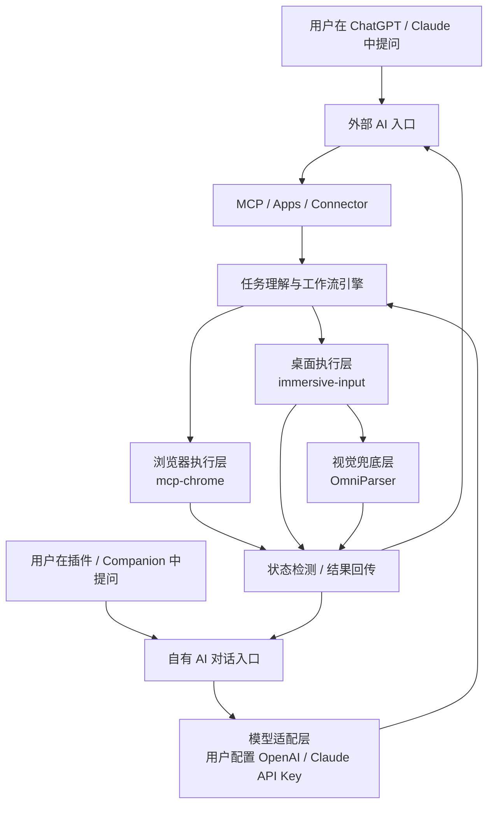

---
tags:
  - RPA
  - UI引导
  - 浏览器扩展
  - 桌面自动化
  - 新手引导
  - 需求文档
created: '2026-04-04'
status: 整理完成
---

# 沉浸式引导实现需求文档方案

> 面向“沉浸式引导”能力建设的需求文档与实施方案，目标是用蒙版、高亮、引导框和自动化能力，对网页或桌面程序提供分步骤引导，并把 AI 的问答能力升级为任务执行能力。

**收费定位是靠中转api网管以及mcp兼容层工具**，有mcp功能的网站，直接接洽对应的mcp

## 需求与定位

### 我的需求

- 能覆盖浏览器网页，也能覆盖独立桌面程序窗口
- 能高亮当前目标区域，并通过镂空、气泡、说明文案告诉用户“现在做什么”
- 在人工引导模式下，蒙版应支持点击穿透，让用户真实操作下层界面
- 在自动执行模式下，系统应能模拟点击、输入、状态检测和失败重试
- 引导过程应支持多步骤推进、状态检测、异常处理和可配置扩展
- 产品既要能被 ChatGPT、Claude 这类主流 AI 工具调用，也要支持插件或 companion 自带对话能力独立发起任务
- 最终要形成一套可落地的实现方案，而不是只停留在概念说明

### 真实诉求与产品定位

这次需求的核心，不是单纯做一个“浮层引导组件”，而是要做一个**让主流 AI 从“回答问题”升级为“带用户把事做完”的执行层**。

更准确地说，产品的真实诉求是：

- 当用户在 ChatGPT、Claude 等主流 AI 中提问时，AI 不只是返回文字答案，而是可以调用你的能力
- 当用户不在主流 AI 工具中时，也可以直接在你的插件或 companion 中发起对话和任务
- 不管任务从哪里进入，后续都走同一套任务理解、工作流、引导标注和本地执行能力
- 用户最终得到的不是“知道怎么做了”，而是“AI 正在带我完成这件事”
- 你的产品既能借助主流 AI 平台获取入口流量，也能保留自己的独立产品入口

因此，这个产品的定位更接近：

- **AI 原生的任务执行引导平台**
- **AI 到真实软件界面的最后一公里能力层**
- **把自然语言意图转化为可执行步骤和界面引导的中间层**
- **同时具备外部 AI 入口与自有 AI 入口的双入口产品**

一句话概括：

> 产品目标不是让 AI 回答得更详细，而是让 AI 有能力把用户带到真实界面里完成任务；同时，这个能力既能被主流 AI 调用，也能由产品自身直接驱动。

### 典型场景验证

以“支付宝如何开通某个功能”为例，传统 AI 通常只会返回一段说明，让用户自己去页面里找入口、自己判断是否完成。

你希望实现的是另一种体验：

1. 用户可以在 ChatGPT、Claude 中提问，也可以直接在你的插件或 companion 中提问。
2. 系统把提问识别为一个可执行流程型任务，而不是普通问答。
3. 系统输出结构化流程，包括步骤、目标位置、说明文案、完成条件和权限级别。
4. 用户进入支付宝网页或相关程序后，本地执行层开始工作。
5. 系统在真实界面中做标注、高亮、步骤提示。
6. 用户完成一步后，系统自动检测状态并推进下一步。
7. 对于可自动化步骤，系统可选择自动点击、输入或校验。
8. 最终用户感受到的不是“知道怎么做”，而是“AI 正在带我完成开通流程”。

这个例子验证了四件事：

- 你的核心价值不在“解释”，而在“执行引导”
- 你的系统需要连接 AI 会话和真实软件界面
- 仅有外部 AI 调用入口不够，还需要自有入口保证独立可用
- 不管从哪条入口进入，都必须复用同一套任务执行引擎

### 当前开发前提

本方案不是从零开始搭建全部能力，而是**基于已有项目做二次开发与能力整合**。

当前的基本判断是：

- 浏览器侧不重新造一个完整的 Chrome 扩展执行器
- 桌面侧不重新造一个完整的本地宿主壳
- 视觉识别侧不重新造一个完整的 GUI 解析器
- 插件或 companion 自带对话能力不重新造一整套模型平台，而是通过模型适配层调用用户配置的 API Key
- 真正需要自研的核心，是工作流、引导编排、权限控制、状态推进、入口统一和 AI 接入整合

因此，本文后续的技术方案默认采用“**现有项目为基础设施 + 自研引导引擎与工作流层**”的方式推进。

## 产品范围与验收

### 建设目标

- 让主流 AI 从“回答问题”升级为“带用户完成任务”
- 建立统一的双入口模式：外部 AI 入口和自有 AI 入口并存
- 建立统一的任务执行引擎，使不同入口复用同一套能力
- 建立统一的沉浸式引导能力模型，兼容网页与桌面程序
- 支持“人工引导”和“自动执行”两种模式，并允许两者在同一流程中切换
- 通过步骤配置、目标定位、状态检测和结果验证，形成可编排的引导流程
- 优先实现可落地的 MVP，后续再扩展为更强的自动化和跨场景能力

### 适用范围与非目标

适用场景：

- 浏览器页面中的新手引导、功能介绍、流程提示
- Windows 桌面程序的操作培训、引导提示、演示录制
- 桌面应用内嵌 WebView 的混合式引导场景
- 需要人工协作和自动化混用的业务流程
- 用户在 ChatGPT、Claude 中发起任务，或在插件/companion 中直接发起任务的双入口场景

非目标：

- 本文不覆盖移动端原生 App 的引导实现
- 本文不追求一次性解决所有跨平台桌面系统能力，优先聚焦 Windows
- 本文不限定单一技术栈，而是给出分场景可选方案

### 核心需求

功能需求：

1. **双入口接入**
   - 系统需要能被主流 AI 调用，而不是只能独立运行
   - 系统也需要支持插件或 companion 自带对话能力独立发起任务
   - 不同入口最终都要汇聚到同一套任务执行引擎

2. **模型调用与任务理解**
   - 外部 AI 入口通过 `MCP`、Apps、Connector 等方式接入
   - 自有 AI 入口通过模型适配层调用用户配置的 OpenAI、Claude 等 API Key
   - 系统需要支持将自然语言任务转换成结构化工作流

3. **覆盖层与标注**
   - 系统需要能在目标界面之上绘制遮罩层、镂空高亮区域和引导文案
   - 覆盖层应支持置顶显示，并跟随目标界面位置变化

4. **目标定位**
   - 网页场景支持 DOM 选择器或元素引用定位
   - 桌面场景支持窗口句柄、窗口标题、控件树或图像识别定位

5. **步骤编排与推进**
   - 引导流程支持多步骤顺序执行
   - 每一步需配置目标区域、提示内容、推进条件和异常处理规则

6. **人工引导与自动执行**
   - 人工模式下支持点击穿透
   - 自动模式下支持点击、输入、等待、验证、重试、回退或中止

7. **状态检测与验证**
   - 网页场景可基于 DOM、URL、文本状态判断
   - 桌面场景可基于控件状态、截图、图像匹配或消息回执判断

8. **扩展与权限控制**
   - 步骤内容应尽量配置化
   - 系统需要区分“只读提示”“用户确认后执行”“完全自动执行”三类权限等级

非功能需求：

- 引导浮层需要有较好的稳定性，不能频繁错位或遮挡错误
- 目标定位和状态检测应尽量可解释、可调试
- 系统应具备可维护性，便于后续新增步骤模板和流程模板
- 在自动执行模式下，应记录关键日志，便于追踪失败原因
- 外部 AI 入口与自有 AI 入口都应保持可扩展，避免被单一平台锁定
- 涉及账户、支付、认证等敏感流程时，应保留显式授权、审计和中止能力

### MVP 实现范围

第一阶段聚焦“**双入口可用 + 本地可执行**”的最小闭环，而不是一次性完成全部自动化能力。

- 提供统一的工作流描述结构：任务意图、步骤列表、目标定位规则、完成条件、权限级别
- 提供外部 AI 入口：
  - 优先实现 `MCP Server`
  - 能被至少一个主流 AI 入口调用
- 提供自有 AI 入口：
  - 在插件或 companion 中提供内置对话入口
  - 支持用户配置模型提供方和 API Key
  - 通过统一模型适配层发起对话和任务
- 提供本地执行层 MVP：
  - 浏览器侧优先，基于 `mcp-chrome` 完成页面标注、高亮与推进
  - 桌面侧作为下一优先级，基于 `immersive-input` 完成本地 companion / overlay 能力
  - 对复杂桌面界面，基于 `OmniParser` 增强视觉解析与目标定位
- 提供一个标准演示流程：例如“支付宝开通某项功能”，跑通从外部 AI 或自有对话入口到真实界面引导的完整链路
- 自动执行能力先做基础版本：
  - 网页先支持简单点击、输入和结果判断
  - 桌面后续补充基础 RPA 点击和控件状态检测

### 验收标准

- 用户可以在至少一个主流 AI 入口中触发该能力
- 用户也可以在插件或 companion 自带对话框中直接触发该能力
- 两类入口都能把用户问题转成结构化任务，并调用同一套引导系统
- 可以在网页上对指定元素进行高亮、提示和步骤推进
- 可以在 Windows 桌面程序上对指定窗口进行覆盖、镂空和引导说明
- 人工引导模式下，用户点击能够穿透到真实目标界面
- 自动执行模式下，系统能够完成至少一条标准流程的点击、输入和校验
- 系统支持至少一条“从 AI 对话到真实界面引导”的完整演示流程
- 当目标未找到或执行失败时，系统能够提示错误并终止或重试
- 对高风险步骤，系统能够进行权限提示、用户确认或安全中断

## 总体架构与当前基线

### 双入口总体架构

从产品能力角度看，建议采用六层结构：

1. **外部 AI 入口层**
   - ChatGPT、Claude 等主流 AI 产品或 API
   - 负责承接用户在外部 AI 中发起的任务

2. **自有 AI 入口层**
   - 插件或 companion 自带对话框
   - 负责承接用户在产品内部直接发起的任务

3. **接入与模型调用层**
   - 外部入口通过 `MCP`、Apps、Connector 等方式接入
   - 自有入口通过模型适配层调用用户配置的 OpenAI、Claude 等 API Key

4. **任务理解与工作流引擎**
   - 负责把用户问题转换成结构化任务
   - 负责匹配流程模板、步骤定义、完成条件、权限等级和异常策略

5. **本地执行层**
   - 浏览器扩展：负责 DOM 高亮、标注、穿透和网页自动化
   - 桌面 companion：负责窗口覆盖、浮层承载、控件检测和桌面执行

6. **反馈与验证层**
   - 负责状态检测、截图验证、日志记录、失败重试和结果回传

本地执行部分的基础思路如下：

```text
① 获取目标程序窗口句柄（HWND）→ 得到窗口位置和大小
② 创建一个透明悬浮窗口覆盖在上面（Always on Top）
③ 在悬浮窗口上绘制蒙版 + 镂空引导框
④ 用户点击时，根据模式决定是否穿透到下层真实程序
⑤ 需要自动操作时，通过脚本或 RPA 执行点击、输入、校验和回传
```

### 为什么不能只做 MCP

`MCP` 很适合做外部 AI 入口的标准接入层，但它本身并不等于整个产品。

- 仅有 MCP，并不能在用户电脑上的真实页面或程序里直接画高亮蒙版
- 仅有外部 AI 调用入口，也不足以保证产品具备独立使用能力
- 你还需要自有 AI 入口，支持插件或 companion 自带对话直接发起任务
- 要让“AI 带用户完成任务”真正发生，仍然需要本地运行时来完成界面标注、点击、检测和回传

所以，正确的产品结构不是“只做一个 MCP 服务”，而是：

- 外部 AI 入口
- 自有 AI 入口
- 统一任务执行引擎
- 本地执行层

### 入口与接入方向

截至 2026 年 4 月 12 日，当前更适合你的入口与接入方向可以归纳为五类：

1. **MCP**
   - 适合作为外部 AI 的统一标准接入层
   - 适合把业务工作流、任务模板和引导能力统一暴露为 AI 工具

2. **OpenAI / ChatGPT Apps**
   - 适合进入 ChatGPT 生态
   - 适合把你的任务引导能力包装成可被 ChatGPT 调用的应用能力

3. **Claude MCP Connector / Claude SDK**
   - 适合通过 Claude API 或代理能力接入你的工作流服务
   - 适合先暴露远程任务工具，再连接更复杂的本地执行能力

4. **插件/Companion 自带对话入口**
   - 适合作为产品自己的独立入口
   - 适合通过模型适配层调用用户配置的 OpenAI、Claude 等 API Key
   - 适合在没有外部 AI 平台参与时独立完成任务发起和执行

5. **本地执行层**
   - 浏览器扩展和桌面 companion 才是你的差异化核心
   - 这层能力决定了你能否把“AI 给答案”升级成“AI 带用户做完”

推荐顺序：

1. `MCP Server`
2. `插件 / Companion 自带对话入口`
3. `OpenAI / ChatGPT Apps`
4. `Claude MCP Connector / Claude SDK`
5. `Chrome Extension + Desktop Companion`
6. `工作流模板引擎`

### 当前项目基线与分工

当前项目不是从零起盘，而是基于三套已有项目做分层组合，并在此基础上补充自有对话入口能力：

- **浏览器执行基线**：`hangwin/mcp-chrome`
- **桌面宿主基线**：`immersive-input`，当前开发起点来自 `pot-app/pot-desktop`
- **视觉解析基线**：`microsoft/OmniParser`
- **自有对话入口能力**：由插件或 companion 本身提供，并通过模型适配层调用用户配置的 API Key

分工如下：

1. **mcp-chrome**
   - 作为浏览器侧的 `MCP + Chrome Extension` 执行底座
   - 负责页面注入、脚本执行、元素点击、表单填充等网页级操作
   - 后续在其上补充引导标注、高亮、步骤推进和状态回传

2. **immersive-input / pot-desktop**
   - 作为桌面侧的 companion 应用、宿主壳和本地能力容器
   - 提供窗口、浮动工具栏、截图、快捷键、系统交互和前端界面承载能力
   - 后续在其上补充引导浮层、任务面板、权限确认、异常反馈和日志展示

3. **OmniParser**
   - 作为桌面端的视觉解析与识别兜底能力
   - 在控件树、窗口句柄、规则定位不足时，提供截图理解和目标区域识别
   - 后续与桌面浮层绘制模块联动，形成“控件定位优先，视觉解析兜底”的策略

4. **插件 / Companion 自带对话入口**
   - 作为产品自己的独立任务入口
   - 支持用户直接在产品中发起对话，不依赖 ChatGPT、Claude 等外部入口
   - 通过模型适配层读取用户配置的模型提供方和 API Key
   - 与外部 AI 入口共享同一套任务理解、工作流和执行引擎

你真正的自研核心位于这些底座之上：

- 入口统一
- AI 请求到任务流程的映射
- 任务模板与步骤编排
- 引导标注、高亮和提示规则
- 权限确认、状态推进、失败处理和结果回传

## 实施方案

### 浏览器侧方案

浏览器侧以 `mcp-chrome` 为当前执行基线，负责把 AI 工具调用落到真实浏览器标签页。它既可以承接外部 AI 入口下发的任务，也可以承接插件自带对话入口下发的任务。

能力结构：

1. **共同前置**
   - Chrome Extension 注入页面
   - Content Script 获取完整 DOM
   - 页面内注入蒙版节点，使用 `position: fixed`、`box-shadow` 或 `clip-path` 做高亮与镂空

2. **人工引导模式**
   - 蒙版设置 `pointer-events: none`
   - 用户点击真实页面，系统通过 `MutationObserver` 或页面状态检测推进步骤
   - 适合新手引导、功能介绍、用户主动学习

3. **自动执行模式**
   - 蒙版只做步骤展示，不必穿透
   - 通过 JS、脚本注入或浏览器自动化能力执行点击、输入和状态验证
   - 适合自动化测试、演示录制、标准流程执行

二开重点：

- 把原始浏览器操作命令升级成“引导步骤工具”
- 增加步骤态管理和状态同步机制
- 增加适用于沉浸式引导的页面标注脚本
- 与工作流引擎打通，支持结构化任务执行

### 桌面侧方案

桌面侧以 `immersive-input` 为宿主基线，以 `OmniParser` 为视觉解析兜底。它既是本地执行壳，也是自有对话入口的重要承载位置。

能力结构：

1. **共同前置**
   - 识别目标窗口与窗口区域
   - 创建透明悬浮窗或引导浮层
   - 在浮层上绘制蒙版、镂空区域、说明文案和状态面板

2. **人工引导模式**
   - 浮层支持鼠标穿透
   - 用户操作下层程序，系统通过控件状态或窗口状态检测判断是否完成
   - 适合桌面培训、流程说明、人机协同引导

3. **自动执行模式**
   - 浮层展示“当前正在执行的步骤”
   - 桌面执行层负责点击、输入、等待和校验
   - 当规则定位不稳定时，由 OmniParser 提供视觉定位兜底

二开重点：

- 增加引导浮层窗口和窗口对齐能力
- 增加执行中状态面板、日志面板和中断控制
- 增加对话入口与任务工作流之间的桥接
- 增加与浏览器侧和视觉解析侧的通信桥接
- 增加桌面任务执行时的权限确认和异常反馈

### 技术对比与组合策略

| 维度       | 浏览器侧                   | 桌面侧                                |
| ---------- | -------------------------- | ------------------------------------- |
| 当前基线   | `mcp-chrome`               | `immersive-input` + `OmniParser`      |
| 任务来源   | 外部 AI 或插件自带对话入口 | 外部 AI 或插件/companion 自带对话入口 |
| 目标定位   | DOM / 选择器 / 页面状态    | 窗口句柄 / 控件树 / 视觉解析          |
| 覆盖层     | 页面内 DOM 蒙版            | 透明悬浮窗 / Companion 浮层           |
| 人工引导   | 点击穿透 + 状态推进        | 穿透浮层 + 控件/窗口状态检测          |
| 自动执行   | JS / 浏览器自动化          | 本地脚本 / RPA / 视觉兜底             |
| 适合优先级 | MVP 优先                   | 第二阶段重点                          |

组合策略：

- 前几步人工引导，复杂配置步骤切换到自动完成
- 桌面主程序与内嵌网页可分别调用桌面和浏览器两套能力
- 外部 AI 入口与自有对话入口共享同一套工作流和执行引擎
- 如果资源有限，优先做“自有对话或外部 AI -> 浏览器引导 -> 状态回传”的闭环

## 推进计划

### 推荐实施策略

- 先做双入口统一：外部 AI 入口与自有对话入口先共用同一套任务工作流协议
- 先做标准接入层：优先落地 `MCP Server`
- 同时做自有对话入口：优先让插件或 companion 能通过用户配置的 API Key 独立对话
- 先做浏览器闭环：优先完成“AI 对话 -> 浏览器引导 -> 状态回传”
- 再补桌面 companion：作为长期护城河逐步补齐
- 人工引导先于全自动：先把“高亮 + 提示 + 状态推进”跑通
- 保留混合模式：前几步人工引导、后几步自动完成
- 围绕高频任务做模板化：优先做高频、高价值、结构相对稳定的流程

### 分阶段落地

1. **第一阶段：验证产品价值**
   - 明确 1 到 2 个高频任务场景，例如“支付宝开通某项功能”
   - 证明用户更愿意使用“AI 引导完成任务”，而不是只看文字答案
   - 验证从外部 AI 或自有对话入口到本地界面引导的转化路径是否顺畅

2. **第二阶段：打通双入口闭环**
   - 打通 `MCP Server`，让至少一个主流 AI 入口能够调用你的能力
   - 打通插件或 companion 内置对话入口，支持通过用户 API Key 发起任务
   - 建立统一的步骤数据结构，支持标题、说明、目标、触发条件、完成条件和权限等级
   - 打通浏览器页面引导链路：目标定位、蒙版绘制、步骤推进、结果回传

3. **第三阶段：增强执行能力**
   - 浏览器场景增加点击、输入、等待、校验能力
   - 桌面场景增加 companion、控件检测、视觉兜底和执行能力
   - 增加失败重试、超时中断和日志记录

4. **第四阶段：平台化与模板化**
   - 将引导步骤抽象为配置文件或可视化配置
   - 支持多个业务流程复用同一套引导引擎
   - 增加 Demo 模式、培训模式、自动执行模式的统一切换能力
   - 扩展更多 AI 入口和更多应用模板，把单点能力升级为平台能力

## 参考与附录

### 当前采用的项目基线

- [hangwin/mcp-chrome](https://github.com/hangwin/mcp-chrome)
- [xujinhuan675-cloud/immersive-input](https://github.com/xujinhuan675-cloud/immersive-input)
- [pot-app/pot-desktop](https://github.com/pot-app/pot-desktop)
- [microsoft/OmniParser](https://github.com/microsoft/OmniParser)

### 主流 AI 接入与标准协议

- [MCP 官方文档](https://modelcontextprotocol.io/docs/getting-started/intro)
- [MCP 官方 SDK](https://modelcontextprotocol.io/docs/sdk)
- [OpenAI Developers](https://developers.openai.com/)
- [OpenAI Apps SDK](https://developers.openai.com/apps-sdk/)
- [OpenAI API · MCP](https://developers.openai.com/api/docs/mcp)
- [Anthropic Claude MCP Connector](https://platform.claude.com/docs/zh-CN/agents-and-tools/mcp-connector)
- [Anthropic SDK · MCP](https://docs.anthropic.com/en/docs/claude-code/sdk/sdk-mcp)

### 补充技术参考

- [Shepherd.js](https://shepherdjs.dev/)
- [Driver.js](https://driverjs.com/)
- [Playwright](https://playwright.dev/)
- [pywinauto](https://github.com/pywinauto/pywinauto)
- [TagUI](https://github.com/aisingapore/TagUI)
- [SikuliX](http://sikulix.com/)
- [Python-UIAutomation-for-Windows](https://github.com/yinkaisheng/Python-UIAutomation-for-Windows)

### 架构图


